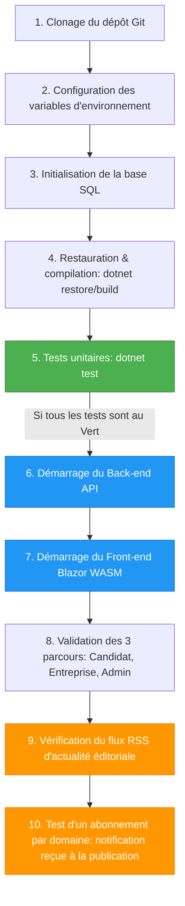
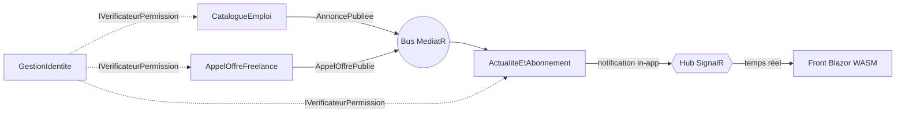

# 💼 Plateforme-CVTech

Monolithe modulaire **Enterprise-Grade** en **.NET 10** réunissant trois usages sur une seule
identité et un seul CV :

1. 💼 **Job board** (recrutement permanent) — annonces d'emploi publiques, candidatures.
2. 🤝 **Marketplace freelance** — appels d'offre, propositions chiffrées, sélection du lauréat.
3. 📰 **Fil d'actualité éditorial** — flux **RSS 2.0 public** + **notifications temps réel** par domaine métier.

Front **Blazor WebAssembly** (3 parcours : Candidat / Entreprise / Administrateur) hébergé par
l'API. Persistance **EF Core / Azure SQL** (un schéma par module). Déploiement **Bicep + Azure DevOps**.

> 📄 Déploiement Azure détaillé : voir **[DEPLOIEMENT-AZURE.md](DEPLOIEMENT-AZURE.md)**.
>
> 🌱 **Données de démo** : l'outil `tools/CVTech.Seeder` (Bogus, locale fr) peuple Azure SQL avec
> des données réalistes et 3 comptes de test (`admin@` / `entreprise@` / `candidat@cvtech.fr`,
> mot de passe `Demo!2026`). Voir [DEPLOIEMENT-AZURE.md §A.7](DEPLOIEMENT-AZURE.md).

---

## 🚀 Démarrage rapide (local, SQLite)

```bash
# 1. Cloner
git clone https://github.com/Virgile-Eratel/Plateforme-CVTech && cd Plateforme-CVTech

# 2. Restaurer + compiler
dotnet restore CVTech.slnx
dotnet build   CVTech.slnx

# 3. Lancer les tests (doivent être au vert avant de démarrer)
dotnet test CVTech.slnx          # 51 tests

# 4. Démarrer l'application (API + front Blazor servis ensemble)
dotnet run --project src/Api/CVTech.Api.csproj

# 5. Ouvrir le front
#    → http://localhost:5229
```

En local, aucune base à installer : chaque module crée son fichier SQLite
(`cvtech-identite.db`, `cvtech-emploi.db`, …) au premier démarrage (`EnsureCreated`).
Le choix du fournisseur se fait par configuration `Persistence:Provider`
(`Sqlite` en local, `SqlServer` au déploiement).

---

## 🗺️ Ordre d'exécution (du clonage à la notification)



> 🛠️ **Étapes 2 & 3 en local** : aucune action requise — la configuration par défaut
> (`appsettings.json` → `Persistence:Provider = Sqlite`) crée les bases automatiquement.
> En cible Azure, ces deux étapes sont prises en charge par le pipeline (cf. DEPLOIEMENT-AZURE.md).

---

## 🏗️ Architecture

**Monolithe modulaire** : 4 modules métier étanches, communiquant uniquement par
**contrats publics** (`*.Contracts`) ou par un **bus d'événements interne MediatR**.

```text
src/
├── Api/                         # Host : composition root, hébergement du front WASM
├── Web/                         # Front Blazor WebAssembly (3 parcours)
├── SharedKernel/                # Briques transverses (bus, permissions, base Domaine)
└── Modules/
    ├── GestionIdentite/         # Profils, rôles, matrice de permissions (IVerificateurPermission)
    ├── CatalogueEmploi/         # Annonces, CV, candidatures → émet AnnoncePubliee
    ├── AppelOffreFreelance/     # Appels d'offre, propositions, lauréat → émet AppelOffrePublie
    └── ActualiteEtAbonnement/   # Fil RSS éditorial + abonnements & notifications (SignalR)
```

Chaque module suit **5 couches** (dépendances vers l'intérieur) :
`Client` (endpoints) → `Application` (vertical slices MediatR) → `Domaine` (DDD, 100 % français)
→ `Infrastructure` (EF Core, RSS, SignalR) → `Loader` (composition root).

> Détails et décisions figées : `docs/adr/` (ADR 0001 à 0010).

### Communication inter-modules



---

## 🔌 Endpoints de l'API

| Méthode | Route | Rôle requis | Description |
|---|---|---|---|
| POST | `/identite/inscription` | public | Inscription (email + mot de passe + `role`) → renvoie un **jeton JWT** |
| POST | `/identite/connexion` | public | Connexion (email + mot de passe) → renvoie un **jeton JWT** |
| POST | `/identite/comptes/{id}/blocage` | Admin | Bloquer un compte |
| GET | `/emploi/annonces` `?domaine=` | public | Lister les annonces |
| POST | `/emploi/annonces` | Entreprise/Admin | Publier une annonce → `AnnoncePubliee` |
| POST | `/emploi/cv` | Candidat/Admin | Constituer / mettre à jour son CV (un seul CV par candidat) |
| GET | `/emploi/mon-cv` | Candidat/Admin | Consulter son CV (`204` si aucun) |
| POST | `/emploi/annonces/{id}/candidatures` | Candidat | Postuler |
| GET | `/freelance/appels-offre` `?domaine=` | public | Lister les appels d'offre |
| POST | `/freelance/appels-offre` | Entreprise/Admin | Publier un AO → `AppelOffrePublie` |
| POST | `/freelance/appels-offre/{id}/propositions` | Candidat | Soumettre une proposition |
| POST | `/freelance/appels-offre/{id}/laureat` | Entreprise/Admin | Sélectionner le lauréat |
| GET | `/feed/rss` `?domaine=` | **public/anonyme** | Flux RSS 2.0 éditorial |
| POST | `/actualite/articles` | Admin | Publier un article |
| POST | `/actualite/abonnements` | connecté | S'abonner à des domaines |
| GET | `/actualite/notifications/{id}` | connecté | Notifications in-app |
| WS | `/hubs/notifications` | connecté | Hub SignalR (`Rejoindre`, `RecevoirNotification`) |

---

## 🔐 Matrice de permissions

Source de vérité du contrôle d'accès, portée par `GestionIdentite` et appliquée par
`IVerificateurPermission.ExigerAsync` en **première ligne** de chaque handler protégé
(refus → **403**). Les trois autres modules ne lisent jamais la base d'identité directement.

| Action | Anonyme | Candidat | Entreprise | Admin |
|---|:---:|:---:|:---:|:---:|
| Consulter une annonce / un appel d'offre | ✅ | ✅ | ✅ | ✅ |
| Consulter le fil RSS (`/feed/rss`) | ✅ | ✅ | ✅ | ✅ |
| Constituer / modifier son CV | ❌ | ✅ | ❌ | ✅ |
| Consulter son CV | ❌ | ✅ | ❌ | ✅ |
| Postuler à une annonce | ❌ | ✅ | ❌ | ❌ |
| Soumettre une proposition freelance | ❌ | ✅ | ❌ | ❌ |
| Publier une annonce d'emploi | ❌ | ❌ | ✅ (les siennes) | ✅ |
| Publier un appel d'offre | ❌ | ❌ | ✅ (les siens) | ✅ |
| Consulter les candidatures / propositions reçues | ❌ | ❌ | ✅ (siennes) | ✅ |
| Sélectionner le lauréat d'un appel d'offre | ❌ | ❌ | ✅ (les siens) | ✅ |
| S'abonner à un domaine métier | ❌ | ✅ | ✅ | ✅ |
| Publier un article du fil d'actualité | ❌ | ❌ | ❌ | ✅ |
| Modérer / supprimer une annonce ou un AO | ❌ | ❌ | ❌ | ✅ |
| Bloquer / réactiver un compte | ❌ | ❌ | ❌ | ✅ |

Un test prouve qu'une action interdite est refusée (cf. `cvtech-permissions` et la suite de tests).

---

## ✅ Validation des livrables

### 1) Les 3 parcours (via le front `http://localhost:5099`)

| Parcours | Étapes |
|---|---|
| 👤 **Candidat** | *Compte* → s'inscrire (rôle Candidat) → *Emploi* : constituer son CV, postuler → *Freelance* : proposer → *Actualité* : s'abonner à un domaine |
| 🏢 **Entreprise** | *Compte* → s'inscrire (rôle Entreprise) → *Emploi* : publier une annonce → *Freelance* : publier un AO + sélectionner un lauréat |
| 🛡️ **Administrateur** | *Compte* → s'inscrire (rôle Administrateur) → *Administration* : publier un article, bloquer un compte |

> **Authentification JWT** (ADR 0008) : à l'inscription/connexion, le front reçoit un jeton
> qu'il joint à chaque requête (en-tête `Bearer`) et à la connexion SignalR. L'identité est
> dérivée du jeton côté serveur — jamais d'un champ de requête. Les actions exigent un jeton
> (401 sinon) et respectent la matrice de permissions (403).

### 2) Flux RSS éditorial (W3C)

```bash
curl http://localhost:5099/feed/rss
# ou avec filtre :
curl "http://localhost:5099/feed/rss?domaine=Cloud%20Azure"
```
Le flux est un **RSS 2.0 valide** (validable sur https://validator.w3.org/feed/) et ne contient
**que** les articles éditoriaux — jamais d'annonces ni d'appels d'offre.

### 3) Notification par abonnement (temps réel)

```bash
B=http://localhost:5099
jeton(){ python3 -c 'import sys,json;print(json.load(sys.stdin)["jeton"])'; }
# Candidat : inscription (renvoie un jeton) puis abonnement au domaine "Cloud Azure"
TOKC=$(curl -s -X POST $B/identite/inscription -H 'Content-Type: application/json' \
  -d '{"email":"c@test.fr","motDePasse":"Secret123","role":0}' | jeton)
curl -s -X POST $B/actualite/abonnements -H "Authorization: Bearer $TOKC" \
  -H 'Content-Type: application/json' -d '{"domaines":["Cloud Azure"],"canal":0}'
# Entreprise : inscription puis publication d'une annonce dans ce domaine
TOKE=$(curl -s -X POST $B/identite/inscription -H 'Content-Type: application/json' \
  -d '{"email":"e@test.fr","motDePasse":"Secret123","role":1}' | jeton)
curl -s -X POST $B/emploi/annonces -H "Authorization: Bearer $TOKE" \
  -H 'Content-Type: application/json' \
  -d '{"titre":"Ingénieur Cloud","description":"...","typeContrat":0,"domaineLibelle":"Cloud Azure"}'
# Le candidat lit SES notifications (identité dérivée du jeton)
curl -s $B/actualite/notifications -H "Authorization: Bearer $TOKC"
```
Dans le navigateur, la même publication fait apparaître un **toast 🔔 en temps réel** côté candidat
abonné (SignalR), et **uniquement** pour les abonnés du domaine.

---

## 🧪 Tests (TDD)

```bash
dotnet test CVTech.slnx
```
**51 tests** (xUnit + FluentAssertions + NSubstitute) couvrant invariants du Domaine,
permissions (refus = 403), événements, RSS et notifications. Noms en français décrivant une règle métier.

---

## 🤖 AI Skills (règles d'architecture)

Trois skills dans `.claude/skills/` encodent les barrières du projet :

- **cvtech-architecture** — 5 couches, dépendances vers l'intérieur, pas de DbContext dans le
  Domaine, pas de logique dans les endpoints, communication inter-modules par contrat/bus uniquement.
- **cvtech-permissions** — `IVerificateurPermission.ExigerAsync` en 1ʳᵉ ligne de chaque handler
  protégé (refus → 403), vérification de propriété, refus des comptes bloqués, matrice de permissions.
- **cvtech-tdd** — test rouge d'abord (Red → Green → Refactor), nommage métier français.

---

## 📦 Stack technique

.NET 10 · ASP.NET Core Minimal APIs · MediatR · EF Core 10 (SQLite / Azure SQL) ·
SignalR · Blazor WebAssembly · Bicep · Azure DevOps Pipelines.
